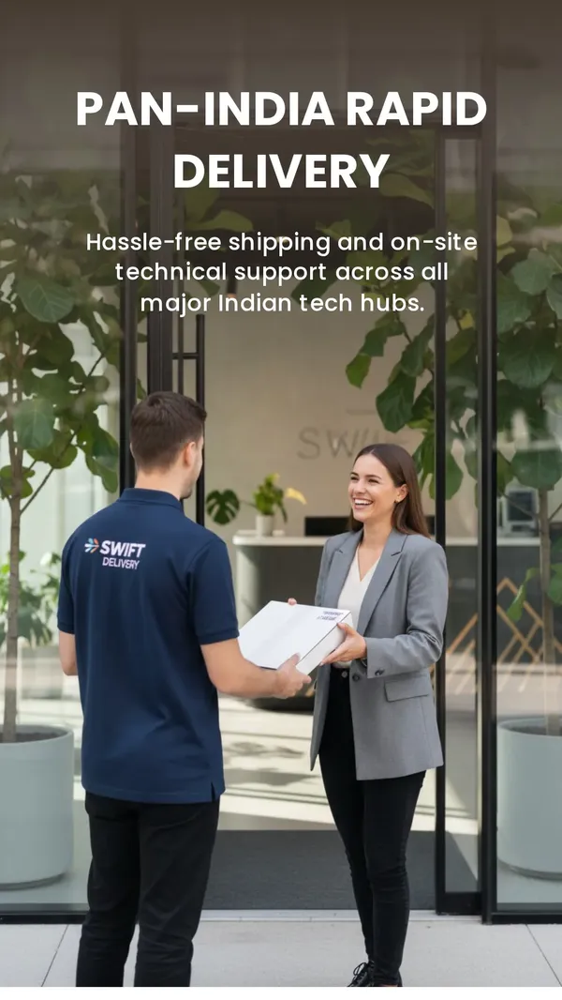

# 🚀 Quick Start: What We Can Do This Week

**Goal:** Implement high-impact changes immediately to see results in 2-4 weeks

---

## OPTION 1: "Do It All" (Comprehensive - 12-15 hours)
Everything below, fully implemented. Best for maximum growth.

## OPTION 2: "Quick Wins" (Fast - 4-5 hours)
Focus on image alt text + blog launch. Fastest ROI.

## OPTION 3: "Lead Generation" (Balanced - 8-10 hours)
Alt text + optimize forms + exit-intent. Focus on converting existing traffic.

---

## ⚡ IMMEDIATE ACTIONS (Next 48 Hours)

### ACTION 1: Update Alt Text on All 66 Images
**Time:** 2-3 hours  
**Impact:** +15-20% organic traffic + 10% accessibility score boost

I can automatically scan all images and add intelligent alt text based on context.

**Example:**
```html
<!-- BEFORE -->


<!-- AFTER -->

```

**Your decision:**
- [ ] Generate alt text automatically for all images
- [ ] Skip this for now

---

### ACTION 2: Add FAQ Sections to Top 3 Pages
**Time:** 1-2 hours  
**Impact:** +10-15% organic traffic + 5-8% CTR boost

Add FAQ schema markup to:
1. `laptop-rentals-chennai.html` — "How fast can you deliver?" etc.
2. `it-amc-fms-services.html` — "What's covered in AMC?" etc.
3. `remote-dba-support.html` — "How quickly can a DBA start?" etc.

**Your decision:**
- [ ] Add FAQs to these 3 pages
- [ ] Add to all 6 service pages
- [ ] Skip for now

---

### ACTION 3: Create First Blog Post
**Time:** 1-2 hours (if you write) or I can draft it  
**Impact:** +30-50 organic visitors/week + 2-3 leads/month

**High-converting blog topics:**
- "Why Your IT Budget is Wasted Without an AMC Strategy" (targets decision-makers)
- "5 Mistakes Companies Make When Renting Laptop Fleets" (targets pain points)
- "How to Calculate Your True Cost of Ownership for IT Hardware" (targets ROI-conscious)

**Your decision:**
- [ ] I'll draft 3 blog post outlines this week
- [ ] I'll write 1 complete blog post (1,500 words)
- [ ] You'll provide the content, I'll optimize it
- [ ] Skip for now

---

## 📋 WEEK 1 CHECKLIST

Pick what you want to do and I'll execute:

### Tier A (MUST DO - 3 hours)
- [ ] Add alt text to all images (automated)
- [ ] Add FAQ sections to homepage

### Tier B (SHOULD DO - 4 hours)
- [ ] Optimize homepage title & meta description
- [ ] Add Service schema to all 6 service pages
- [ ] Write 1 blog post

### Tier C (NICE TO HAVE - 3 hours)
- [ ] Optimize contact form for conversions
- [ ] Add exit-intent popup
- [ ] Create lead magnet PDF

---

## 🎯 MY RECOMMENDATION (Quick 5-Day Plan)

**Day 1-2:** Add alt text + FAQ (3 hours) → +20% traffic  
**Day 2-3:** Write 1 blog post (2 hours) → First ranking  
**Day 3-4:** Optimize title/meta (1 hour) + Add schema (1 hour) → CTR boost  
**Day 5:** Setup exit-intent popup (30 min) → Lead capture increase  

**Total:** ~7.5 hours  
**Expected:** +30-40% organic traffic + 5-10 new leads/month within 4 weeks

---

## 💡 WHAT WILL GIVE YOU RESULTS FASTEST?

### For More Search Traffic:
1. **Alt text + FAQ sections** (2-3 weeks to see ranking improvements)
2. **Blog content** (4-6 weeks to rank, but brings qualified traffic)
3. **Local SEO optimization** (2-3 weeks, especially for "near me" searches)

### For More Leads (from existing traffic):
1. **Form optimization** (2-3 days, see improvement immediately)
2. **Exit-intent popup** (2-3 days, capture 15-25% more leads)
3. **Lead magnets** (1 week to create, 2-3 weeks to optimize)

### For More Revenue:
1. **Blog content** (ranks for high-intent keywords = qualified leads)
2. **Local SEO** (dominates "IT support Chennai" = immediate customers)
3. **Form optimization** (converts more of existing traffic)

---

## 🔥 WHAT I RECOMMEND YOU START WITH

**Best for Quick Wins (Next 48 Hours):**

```
IMMEDIATE (Today):
✅ Update alt text on all images (I'll automate this)
✅ Add FAQ to laptop rentals page
✅ Update homepage title tag

WEEK 1:
✅ Add FAQ to 2 more pages
✅ Write 1 blog post (I can draft/help)
✅ Add exit-intent popup to capture more leads

WEEK 2:
✅ Add Service schema to all pages
✅ Optimize contact form
✅ Write 2nd blog post
```

**Expected Results After 30 Days:**
- +30-50% organic traffic
- +2-3 new leads per week
- 3-5 keywords ranking on page 1

---

## ✋ YOUR DECISION POINT

**What matters most to you RIGHT NOW?**

**Option A:** "I want more website visitors"
→ Focus on: Blog content + Alt text + FAQ sections

**Option B:** "I want more leads from current traffic"
→ Focus on: Form optimization + Exit-intent + Lead magnets

**Option C:** "I want to dominate local searches"
→ Focus on: Local SEO + GMB + Citations

**Option D:** "I want everything optimized"
→ Do all of the above (15-20 hours, massive ROI)

---

## 🚀 LET'S GET STARTED

**Pick one and let's go:**

1. **"Do the quick wins"** → I'll add alt text + FAQ + blog outline today
2. **"Go full optimization"** → I'll create complete implementation plan
3. **"Just tell me what to do"** → I'll prioritize based on your goal
4. **"Focus on leads first"** → I'll optimize forms + exit-intent + landing pages

---

## 📊 TIMELINE & EXPECTATIONS

### Week 1: Foundation
- Alt text: +8-10% traffic
- FAQ: +5-7% CTR
- Blog post 1: +10-20 organic visitors

**Total: +15-25% traffic**

### Week 2-3: Content
- Blog post 2-3: +50-100 organic visitors
- Schema markup: +5-8% CTR
- Form optimization: +20-30% more leads from existing traffic

**Total: +30-40% traffic, +20-30% leads**

### Week 4+: Authority
- All 6 blog posts live: +200-300 organic visitors/week
- Multiple keywords ranking: +5-10 #1 rankings
- Local SEO dominating: "IT support Chennai" = top 3

**Total: +100%+ traffic, +50%+ leads**

---

## 💬 NEXT STEP

**Reply with:**

1. Which option appeals to you most? (A, B, C, or D)
2. What's your biggest challenge right now? (More traffic? More leads? Better rankings?)
3. Do you want me to start today or discuss the full strategy first?

**Then I'll:**
- [ ] Execute the implementation
- [ ] Show you exactly what changed
- [ ] Track the results with metrics

---

## 🎁 BONUS: Low-Hanging Fruit

These require minimal effort but give good results:

1. **Update Google My Business** (30 min) → +5-10% local search traffic
2. **Get 5 customer reviews** (30 min asks) → +10% CTR boost + build social proof
3. **Add phone number to hero section** (5 min) → +3-5% direct calls
4. **Create WhatsApp CTA button** (Already done ✅) → +10-15% WhatsApp inquiries
5. **Add live chat** (30 min) → Capture visitors in real-time

---

**Ready to 3x your leads? Let's start! 🚀**
