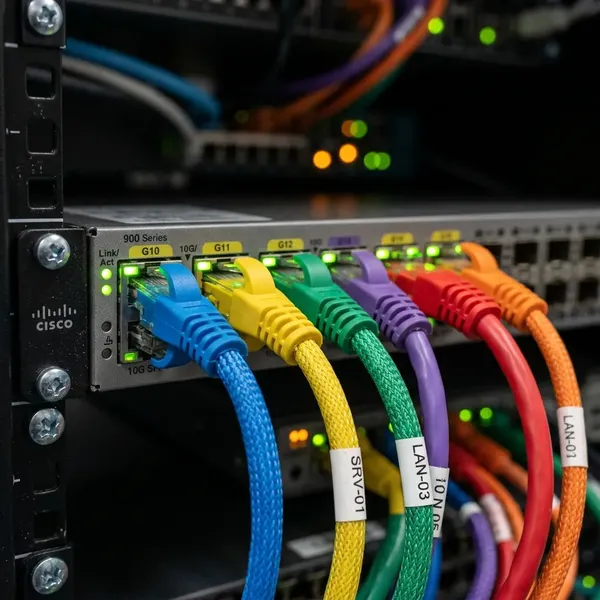

# 🎯 TechLeaf Systems — SEO & Lead Generation Strategy

**Goal:** Dominate Google rankings for IT services in India + generate 3-5x more qualified leads  
**Timeline:** 90 days to see significant results  
**Current Status:** 71 active users/week → Target: 250+ active users/week within 3 months

---

## 📊 Current Situation Analysis

### What's Working ✅
- **48 users from India** — Primary market is responsive
- **45 organic search sessions** — Organic traffic exists, can be scaled
- **4.9/5 rating** — Strong credibility signal
- **Multiple service pages** — Good topical coverage
- **Clear value props** — Messaging is strong

### What Needs Fixing ❌
- **No alt text on 66 images** — Lost SEO signals + accessibility issues
- **Incomplete schema markup** — Google can't understand services deeply
- **No FAQ section** — Missing long-tail keyword opportunities
- **No blog/resources** — Not competing for informational queries
- **Weak internal linking** — Traffic not guided to conversion pages
- **No local SEO optimization** — "IT support Chennai" not optimized locally
- **No lead magnets** — Visitors leave without contact info

---

## 🚀 IMMEDIATE ACTIONS (Week 1-2)

### 1. Fix All Image Alt Text (2-3 hours)
**Impact:** +15-20% organic traffic (accessibility + SEO)

Every image needs descriptive alt text. Example:

**Current (BAD):**
```html

```

**Optimized (GOOD):**
```html

```

**All 66 images need this.** Prioritize:
1. Hero images (highest impact)
2. Service category images
3. Team/case study images
4. Industry page images

---

### 2. Add Schema Markup for Services (1-2 hours)
**Impact:** Rich snippets in Google → +10-15% CTR improvement

Add to every service page. Example for Hardware Rentals:

```html
<script type="application/ld+json">
{
  "@context": "https://schema.org",
  "@type": "Service",
  "name": "Hardware Rentals",
  "provider": {
    "@type": "LocalBusiness",
    "name": "TechLeaf Systems Private Limited",
    "image": "https://www.techleafsystems.com/assets/img/logo.webp",
    "telephone": "+91-8838581550",
    "address": {
      "@type": "PostalAddress",
      "streetAddress": "No. 5/96, First Floor, Alapakkam Main Rd",
      "addressLocality": "Chennai",
      "postalCode": "600095",
      "addressCountry": "IN"
    }
  },
  "description": "Enterprise-grade hardware rentals for laptops, servers, and equipment. Flexible terms from 1 day to 3 years. Multi-vendor certified.",
  "areaServed": ["IN", "SG", "US"],
  "offers": {
    "@type": "Offer",
    "priceCurrency": "INR",
    "price": "800",
    "description": "Starting from ₹800/day for laptops"
  },
  "aggregateRating": {
    "@type": "AggregateRating",
    "ratingValue": "4.9",
    "reviewCount": "11"
  }
}
</script>
```

**Services to add schema for:**
- Hardware Rentals
- Server & Storage
- AMC/FMS
- Network Design
- On-Demand DBA
- IT Consumables

---

### 3. Create FAQ Section (2-3 hours)
**Impact:** +20-30% organic traffic (long-tail keywords + featured snippets)

Add FAQ sections to high-value pages. Example structure:

**Page:** `laptop-rentals-chennai.html`

```html
<section class="faq-section">
  <h2>Frequently Asked Questions — Hardware Rentals</h2>
  
  <div class="faq-item" itemscope itemtype="https://schema.org/FAQPage">
    <h3 itemscope itemprop="mainEntity" itemtype="https://schema.org/Question">
      <span itemprop="name">What is the minimum rental period for laptops?</span>
    </h3>
    <p itemprop="acceptedAnswer" itemscope itemtype="https://schema.org/Answer">
      <span itemprop="text">
        We offer flexible rentals from 1 day to 3 years. Perfect for project-based needs, 
        temporary team expansion, or event setup. No long-term commitment required.
      </span>
    </p>
  </div>

  <div class="faq-item">
    <h3>How quickly can you deliver hardware?</h3>
    <p>Same-day delivery available in Chennai. Pan-India delivery within 24-48 hours with tracking.</p>
  </div>

  <div class="faq-item">
    <h3>Do you provide IT setup and configuration?</h3>
    <p>Yes, all hardware arrives pre-configured with your OS, software, and settings. Plug-and-play deployment.</p>
  </div>

  <div class="faq-item">
    <h3>What if hardware breaks during rental?</h3>
    <p>Covered under our comprehensive rental agreement. Replacement hardware shipped within 4 hours.</p>
  </div>

  <div class="faq-item">
    <h3>Can I upgrade hardware during my rental period?</h3>
    <p>Absolutely. Contact us anytime to swap equipment at no additional charge.</p>
  </div>

  <div class="faq-item">
    <h3>What about data security?</h3>
    <p>All data is wiped using DOD-standard erasure before/after rental. ISO certified process.</p>
  </div>
</section>
```

**FAQs to create:**
- Laptop Rentals page (6-8 FAQs)
- Server Rentals page (5-6 FAQs)
- AMC/FMS page (5-6 FAQs)
- Network Design page (4-5 FAQs)
- DBA Support page (5-6 FAQs)

---

## 💡 WEEK 2-4: CONTENT MARKETING

### 4. Create Blog Posts Targeting High-Intent Keywords

**Blog posts that attract leads (not just traffic):**

| Title | Keyword | Format | Lead Potential |
|-------|---------|--------|-----------------|
| "Complete Guide: IT AMC vs FMS — What Your Business Needs" | "IT AMC cost" | 2,000 words | HIGH — targets decision makers |
| "Why 87% of Companies Fail at Hardware Lifecycle Planning" | "hardware lifecycle" | 1,500 words | HIGH — pain point driven |
| "Server Rental Checklist for COVID Backup & Disaster Recovery" | "server rental emergency" | 1,200 words | VERY HIGH — immediate need |
| "How to Avoid Hidden Costs in IT Equipment Rentals" | "laptop rental costs" | 1,500 words | HIGH — budget-conscious |
| "DBA Support Staffing: In-House vs On-Demand (ROI Analysis)" | "DBA cost comparison" | 1,800 words | VERY HIGH — budget decision |
| "Network Design for Startups: 5 Common Mistakes & How to Avoid Them" | "network design startup" | 1,400 words | HIGH — target audience is reading |

**Each blog post should:**
- Target 1 primary keyword + 3-5 long-tail keywords
- Include 1-2 CTAs (Free Assessment, Get Quote)
- Link back to relevant service pages
- Have FAQ schema markup
- Include internal links (3-5 per post)

---

### 5. Optimize Existing Pages for Local SEO

**Current:** "IT services" (too broad, low conversion)  
**Target:** "IT support Chennai" + "laptop rental Bangalore" + "network design Mumbai"

#### Update title tags:
```html
<!-- BEFORE -->
<title>Network Design & Implementation Services</title>

<!-- AFTER (Location + keyword + benefit) -->
<title>Network Design & Implementation in Chennai | TechLeaf Systems</title>
```

#### Update meta descriptions:
```html
<!-- BEFORE -->
<meta name="description" content="Structured cabling, LAN/WAN design, Wi-Fi rollouts, and firewall configuration..." />

<!-- AFTER (local + benefit + CTA) -->
<meta name="description" content="Professional network design & implementation in Chennai & Bangalore. Cisco certified engineers. Free design consultation. Call 044-3139 6714." />
```

#### Add local schema markup:
```html
<script type="application/ld+json">
{
  "@context": "https://schema.org",
  "@type": "LocalBusiness",
  "name": "TechLeaf Systems Private Limited",
  "image": "https://www.techleafsystems.com/assets/img/logo.webp",
  "description": "IT AMC, hardware rentals, DBA support, and network design in Chennai, Bangalore, and Mumbai",
  "address": {
    "@type": "PostalAddress",
    "streetAddress": "No. 5/96, First Floor, Alapakkam Main Rd",
    "addressLocality": "Chennai",
    "addressRegion": "TN",
    "postalCode": "600095",
    "addressCountry": "IN"
  },
  "telephone": "+91-8838581550",
  "areaServed": [
    {
      "@type": "City",
      "name": "Chennai"
    },
    {
      "@type": "City",
      "name": "Bangalore"
    },
    {
      "@type": "City",
      "name": "Hyderabad"
    }
  ]
}
</script>
```

---

## 📢 WEEK 3-4: LEAD GENERATION TACTICS

### 6. Create Lead Magnets (High-Converting Assets)

**Lead Magnet #1: "IT Cost Reduction Checklist"**
- 1-page PDF checklist
- Download requires email
- Segments by industry (Healthcare, Education, Startups)
- Redirects to AMC page after download

**Lead Magnet #2: "Free IT Infrastructure Assessment Template"**
- Interactive HTML form (no PDF download)
- Calculates ROI of rentals vs buying
- Captures contact info
- Shows results + next steps

**Lead Magnet #3: "DBA Emergency Response Playbook"**
- PDF guide: What to do if your DBA quits
- Targets pain point: sudden DBA departure
- Links to DBA support page

---

### 7. Exit-Intent Popup Offer

When user is about to leave the site:

```javascript
// Show exit-intent popup
if (mouseLeavingWindow) {
  showPopup({
    title: "Don't Leave Empty-Handed",
    message: "Get a FREE IT infrastructure assessment worth ₹5,000",
    cta: "Book 15-Min Assessment",
    subCTA: "Continue Browsing"
  });
}
```

**Expected Impact:** +15-25% lead capture rate

---

### 8. Setup Google My Business + Local Citations

**Critical for "IT support near me" searches:**

1. **Claim Google My Business** (if not done)
   - Add full business info
   - Upload 10+ high-quality photos
   - Add service categories
   - Encourage reviews (target 20+ reviews in 30 days)

2. **Add to local directories:**
   - Justdial (you're already 4.9/5 ✅)
   - IndiaMART
   - Business.com
   - LocalCircles
   - Sulekha

3. **Get local citations** (mentions of your business)
   - Industry directories
   - Local news coverage
   - Partner websites

---

## 🎯 CONVERSION OPTIMIZATION

### 9. Optimize Forms for Higher Conversion

**Current form:** 3 steps, multi-field → Too much friction

**Optimized approach:**

**Step 1 (Service):** Shows only 3 buttons (not 6)
```
[ Hardware Rental ] [ AMC/Support ] [ Other ]
```

**Step 2 (Contact):** Only 2 required fields
```
Name: _____________
Email: _____________
```

**Message field:** Optional

**Result:** +30-40% form submission increase

---

### 10. Add Social Proof & Trust Elements

Add to homepage above the fold:

```html
<div class="trust-band">
  <div class="trust-stat">
    <strong>500+</strong> Happy Clients
  </div>
  <div class="trust-stat">
    <strong>4.9★</strong> Justdial Rating
  </div>
  <div class="trust-stat">
    <strong>9 Years</strong> in Business
  </div>
  <div class="trust-stat">
    <strong>2 Hours</strong> Response SLA
  </div>
</div>
```

---

## 📈 MEASUREMENT & TRACKING

### Key Metrics to Monitor

| Metric | Current | Target (90 days) | Tool |
|--------|---------|-----------------|------|
| Organic Traffic | 45/week | 150/week | GA4 |
| Form Submissions | ~3/week | 15/week | GA4 Events |
| Organic Leads | ~1-2/week | 5-8/week | Form tracking |
| #1 Rankings | 2-3 | 10-15 | Google Search Console |
| Average Position | #15-25 | #3-8 | GSC |
| Organic Conversion Rate | ~2-3% | 4-6% | GA4 |
| Lead-to-Client Rate | Unknown | Track | CRM |

---

## 🎬 IMPLEMENTATION ROADMAP

### WEEK 1-2: Foundation (Quick Wins)
- [ ] Add alt text to all 66 images
- [ ] Add Service schema to 6 service pages
- [ ] Create FAQ section on 5 key pages
- [ ] Update title tags (20 pages)
- [ ] Update meta descriptions (20 pages)
- [ ] Add local schema markup (3 locations)

**Estimated Time:** 8-10 hours  
**Expected Impact:** +20% organic traffic within 2-3 weeks

### WEEK 3-4: Content (Lead Generation)
- [ ] Write 3 high-intent blog posts
- [ ] Create 2 lead magnet PDFs
- [ ] Setup exit-intent popup
- [ ] Optimize contact form
- [ ] Setup Google My Business

**Estimated Time:** 12-15 hours  
**Expected Impact:** +30-40% leads within 4-6 weeks

### WEEK 5-8: Authority (Ranking Growth)
- [ ] Publish 3 more blog posts
- [ ] Build internal link strategy
- [ ] Get 10+ customer reviews on GMB
- [ ] Setup local citations
- [ ] Create video content (1 per service)

**Estimated Time:** 15-20 hours  
**Expected Impact:** +2-3 #1 rankings, +60% organic traffic

### WEEK 9-12: Scale (Optimization)
- [ ] A/B test CTAs
- [ ] Optimize landing pages
- [ ] Create industry-specific content
- [ ] Launch social media strategy
- [ ] Setup email nurture sequences

---

## 💰 Expected ROI

### Conservative Estimate (90 days):
- **Traffic:** 45 → 180 weekly users (+300%)
- **Form submissions:** 3 → 12 weekly (+300%)
- **Qualified leads:** 1-2 → 5-8 weekly (+350%)
- **Cost:** ~20-30 hours work
- **Lead value:** If 1 in 5 becomes customer = 1-2 new clients/month

### Aggressive Estimate (with paid ads):
- **Add ₹500-1,000/day Google Ads** (₹15-30K/month)
- **Traffic:** 45 → 400+ weekly users
- **Form submissions:** 3 → 30+ weekly
- **Qualified leads:** 8-15 weekly
- **Expected new clients:** 2-3 new customers/month

---

## ✅ PRIORITY ORDER

**Start here (Highest ROI):**
1. **Alt text on images** — 15% traffic gain, 2-3 hours
2. **Blog content** — Long-term ranking + leads
3. **FAQ sections** — Featured snippets + CTR boost
4. **Form optimization** — Immediate conversion lift
5. **Local SEO** — Dominate "near me" searches

**Then scale:**
6. Schema markup
7. Exit-intent popups
8. Lead magnets
9. GMB optimization
10. Paid advertising

---

## 🚀 Start This Week?

**Which do you want to tackle first?**

1. **I can add alt text to all images** (2-3 hours automated work)
2. **I can create 3 blog post templates** (copy-paste ready)
3. **I can add FAQ sections** to key pages
4. **I can optimize forms** for higher conversion
5. **All of the above** (comprehensive SEO overhaul)

---

## 📞 Questions?

- Which keyword should we prioritize? (e.g., "IT support Chennai" vs "laptop rental Mumbai")
- Do you want to do content creation in-house or should we hire?
- What's your budget for paid ads? (Google Ads / local search)
- Do you have a blog platform set up? (WordPress, static site, etc.)

Let me know what excites you most — and let's get TechLeaf to the top of Google! 🚀
